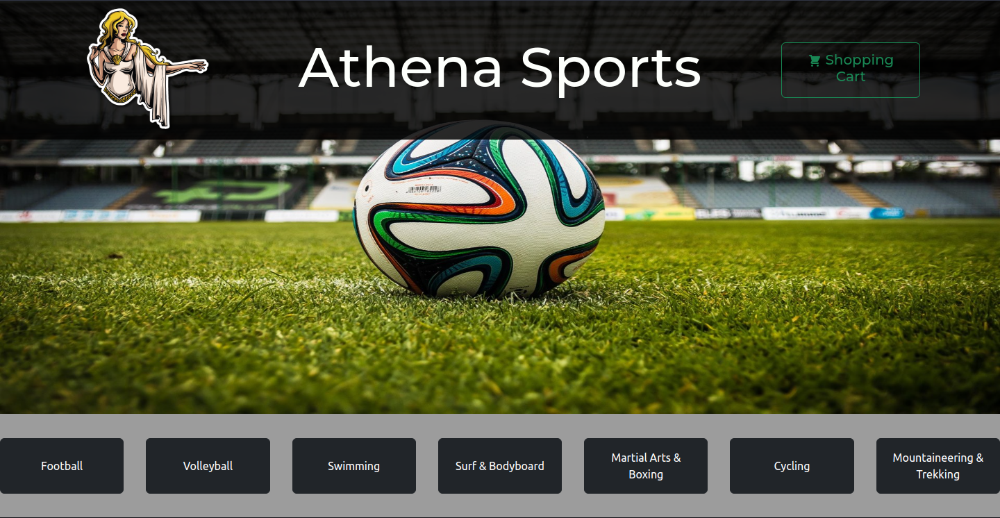
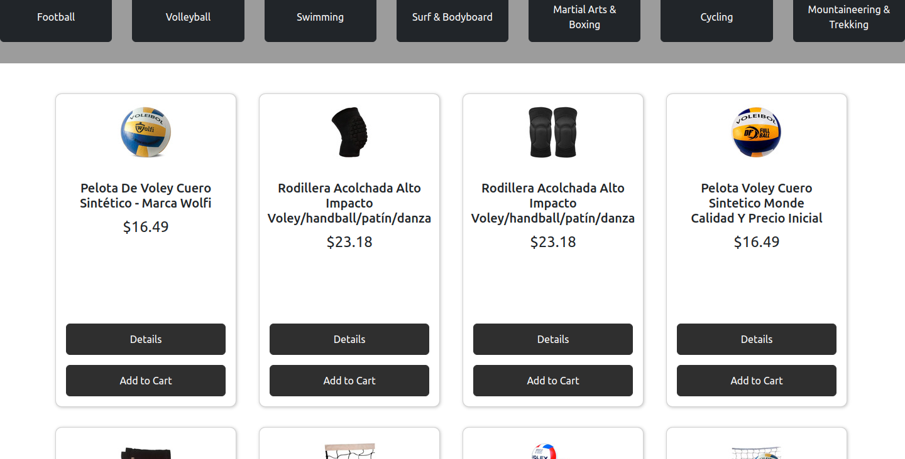
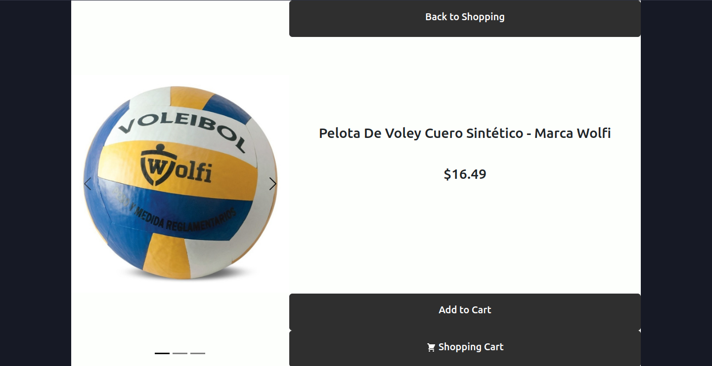
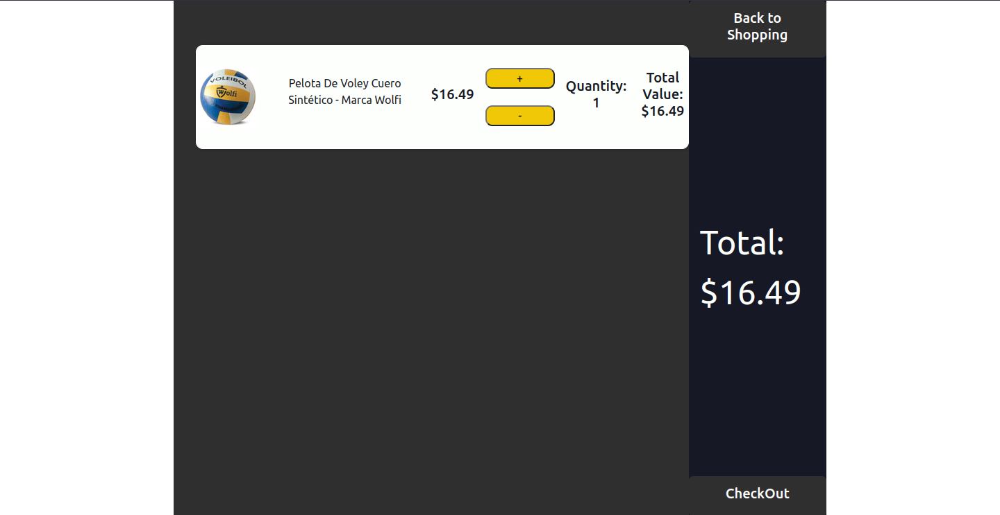

<h1>Athena Sports Store</h1>

Este projeto foi realizado com o intuito de treinar <strong>React.js 18</strong>, <strong>BrowserRouter 5</strong>, <strong>React Hooks</strong>, <strong>Context API</strong>, <strong>Fetch API</strong>, <strong>HTML 5</strong> e <strong>CSS 3</strong>.
 
É um website para uma loja de esportes, contendo 7 <strong>categorias</strong> de produtos, com 50 <strong>itens</strong> de cada categoria.
 
A busca pelas mercadorias é feita no Mercado Livre, através de uma consulta de API. 
 
Cada item representa um produto, e cada produto possui uma página de detalhes. Além disso, também possui um carrinho de compras.
 
Ele se encontra hospedado neste endereço:<a href=”https://athena-sports-e-commerce.vercel.app/” target="_blank"> https://athena-sports-e-commerce.vercel.app/</a>

<h2>Demo</h2>
<ul>
  <li>
    
Página inicial do Site:

    
  </li>
  <li>
    
Página da lista de produtos:

    
  </li>
  <li>
    
Página de detalhes do produto:

    
  </li>
  <li>
    
Página do carrinho de compras:

    
  </li>
</ul>

<h3>API</h3>

Neste projeto foi realizado a busca de produtos no Banco de Dados do Mercado Livre no EndPoint: <a href="https://api.mercadolibre.com/sites/MLA/search?category=">https://api.mercadolibre.com/sites/MLA/search?category=</a> 
  e <a href="https://api.mercadolibre.com/items/">https://api.mercadolibre.com/items/</a>
.